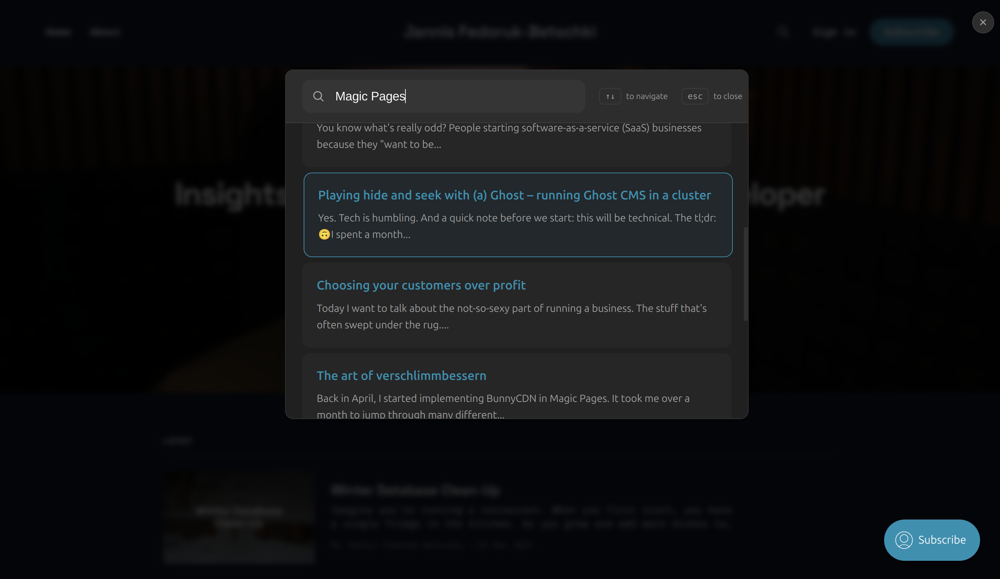

# @magicpages/ghost-typesense-search-ui

A beautiful, accessible search interface for Ghost blogs using Typesense. This package provides a drop-in replacement for Ghost's default search functionality, offering enhanced features and seamless integration with Typesense.



## Features

- 🔍 Real-time search powered by Typesense (needs a Typesense server)
- 🎨 Beautiful, accessible interface
- 🌓 Automatic dark mode support
- ⌨️ Full keyboard navigation
- 📱 Responsive design for all devices
- 🎯 Configurable common searches suggestions
- ⚡ Lightweight and performant
- 🔎 Smart context-aware search result highlighting
- 📝 Plaintext content search for improved relevance
- 💡 Exact phrase matching support
- 🔍 Contextual excerpts that show search term in context
- 🧩 Support for nested fields

## Installation

There are two ways to integrate the search UI into your Ghost site:

### Option 1: Replace Ghost's Default Search (Recommended)

This is the preferred method as it prevents loading two search scripts, resulting in better performance. You'll need access to your Ghost configuration.

Add to your `config.[environment].json`:
```json
"sodoSearch": {
    "url": "https://unpkg.com/@magicpages/ghost-typesense-search-ui/dist/search.min.js"
}
```

Or set the environment variable:
```bash
sodoSearch__url=https://unpkg.com/@magicpages/ghost-typesense-search-ui/dist/search.min.js
```

### Option 2: Code Injection Method

If you're using a managed Ghost host like Ghost(Pro) where you can't modify the configuration, use this method. The script will automatically remove any traces of the default search to prevent conflicts, but cannot prevent the `sodo-search.min.js` from being loaded.

Add to your site's code injection (Settings → Code injection → Site Header):

```html
<script src="https://unpkg.com/@magicpages/ghost-typesense-search-ui/dist/search.min.js"></script>
```

For either method, you can also self-host the `search.min.js` and add that URL instead of `https://unpkg.com/@magicpages/ghost-typesense-search-ui/dist/search.min.js`.

## Configuration

Configure the search by adding a global configuration object before loading the script. You can add this to your theme, or use Ghost's code injection to add it to your site's header.

```html
<script>
window.__MP_SEARCH_CONFIG__ = {
    typesenseNodes: [{
        host: 'your-typesense-host',
        port: '443',
        protocol: 'https'
    }], // also supports a Typesense cluster
    typesenseApiKey: 'your-search-only-api-key', // Under no circumstances use an admin API key here. These values are stored client-side and are therefore accessible to the end user.
    collectionName: 'your-collection-name',
    theme: 'system', // 'light', 'dark', or 'system'
    enableHighlighting: true, // highlight search terms in results
    commonSearches: ['Getting Started', 'Tutorials', 'API'] // can also be empty
};
</script>
```

### Configuration Options

| Option | Type | Required | Description |
|--------|------|----------|-------------|
| `typesenseNodes` | `Array` | Yes | Array of Typesense node configurations |
| `typesenseApiKey` | `String` | Yes | Search-only API key from Typesense |
| `collectionName` | `String` | Yes | Name of your Typesense collection |
| `theme` | `String` | No | UI theme: 'light', 'dark', or 'system' (default) |
| `enableHighlighting` | `Boolean` | No | Whether to highlight search terms in results (default: true) |
| `commonSearches` | `Array` | No | Array of suggested search terms |
| `searchFields` | `Object` | No | Customize field weights and highlighting |

### Search Fields Configuration

Customize search relevance with field weights and highlighting:

```javascript
searchFields: {
    title: { weight: 5, highlight: true },
    plaintext: { weight: 4, highlight: true },
    excerpt: { weight: 3, highlight: true },
    html: { weight: 1, highlight: true }
}
```

The default weights are optimized to provide the most relevant results, prioritizing title matches, then plaintext content, followed by excerpt and HTML content.

## Usage

The search interface can be triggered in multiple ways:
- Click the search icon in your Ghost theme
- Press `/` on your keyboard
- Navigate to `/#/search` URL
- Use URL query parameters: `/?s=your search term` or `/?q=your search term` 
- Programmatically via `window.magicPagesSearch.openModal()`

### URL-Based Search

You can trigger searches directly from URLs using two formats:

#### 1. Query Parameter Format
```
https://yourblog.com/?s=getting+started
https://yourblog.com/?q=tutorials
```

Both `s` and `q` query parameters are supported for maximum compatibility with legacy links.

#### 2. Clean Hash Path Format
```
https://yourblog.com/#/search/getting+started
```

### Keyboard Shortcuts

- `/`: Open search
- `↑/↓`: Navigate through results
- `Enter`: Select result
- `Esc`: Close search

## Customization

The search UI automatically detects and uses your Ghost site's accent color by reading the `--ghost-accent-color` CSS variable. This ensures that the search interface matches your site's branding.

The UI also includes a built-in dark mode that automatically activates based on the user's system preferences. It can also be overwritten in the UI's configuration.

## License

MIT © [MagicPages](https://www.magicpages.co)