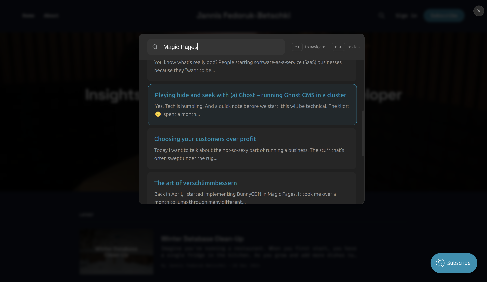

# @magicpages/ghost-typesense-search-ui

A beautiful, accessible search interface for Ghost blogs using Typesense. This package provides a drop-in replacement for Ghost's default search functionality, offering enhanced features and seamless integration with Typesense.



## Features

- 🔍 Real-time search powered by Typesense (needs a Typesense server)
- 🎨 Beautiful, accessible interface
- 🌓 Automatic dark mode support
- ⌨️ Full keyboard navigation
- 📱 Responsive design for all devices
- 🎯 Configurable common searches suggestions
- ⚡ Lightweight and performant
- 🔎 Smart context-aware search result highlighting
- 📝 Plaintext content search for improved relevance
- 💡 Exact phrase matching support
- 🔍 Contextual excerpts that show search term in context
- 🧩 Support for nested fields
- 🛡️ **Style encapsulation with Web Components** - Uses Shadow DOM to prevent Ghost theme styles from interfering with the search UI

## Installation

There are two ways to integrate the search UI into your Ghost site:

### Option 1: Replace Ghost's Default Search (Recommended)

This is the preferred method as it prevents loading two search scripts, resulting in better performance. You'll need access to your Ghost configuration.

Add to your `config.[environment].json`:
```json
"sodoSearch": {
    "url": "https://unpkg.com/@magicpages/ghost-typesense-search-ui/dist/search.min.js"
}
```

Or set the environment variable:
```bash
sodoSearch__url=https://unpkg.com/@magicpages/ghost-typesense-search-ui/dist/search.min.js
```

### Option 2: Code Injection Method

If you're using a managed Ghost host like Ghost(Pro) where you can't modify the configuration, use this method. The script will automatically remove any traces of the default search to prevent conflicts, but cannot prevent the `sodo-search.min.js` from being loaded.

Add to your site's code injection (Settings → Code injection → Site Header):

```html
<script src="https://unpkg.com/@magicpages/ghost-typesense-search-ui/dist/search.min.js"></script>
```

For either method, you can also self-host the `search.min.js` and add that URL instead of `https://unpkg.com/@magicpages/ghost-typesense-search-ui/dist/search.min.js`.

## Configuration

Configure the search by adding a global configuration object before loading the script. You can add this to your theme, or use Ghost's code injection to add it to your site's header.

```html
<script>
window.__MP_SEARCH_CONFIG__ = {
    typesenseNodes: [{
        host: 'your-typesense-host',
        port: '443',
        protocol: 'https'
    }], // also supports a Typesense cluster
    typesenseApiKey: 'your-search-only-api-key', // Under no circumstances use an admin API key here. These values are stored client-side and are therefore accessible to the end user.
    collectionName: 'your-collection-name',
    theme: 'system', // 'light', 'dark', or 'system'
    enableHighlighting: true, // highlight search terms in results
    commonSearches: ['Getting Started', 'Tutorials', 'API'] // can also be empty
};
</script>
```

### Configuration Options

| Option | Type | Required | Default | Description |
|--------|------|----------|---------|-------------|
| `typesenseNodes` | `Array` | Yes | — | Array of Typesense node configurations (`host`, `port`, `protocol`) |
| `typesenseApiKey` | `String` | Yes | — | Search-only API key from Typesense |
| `collectionName` | `String` | Yes | — | Name of your Typesense collection |
| `theme` | `String` | No | `'system'` | UI theme: `'light'`, `'dark'`, or `'system'` (respects OS preference) |
| `enableHighlighting` | `Boolean` | No | `true` | Whether to highlight search terms in results |
| `commonSearches` | `Array` | No | `[]` | Static fallback list of suggested search terms (see [Search suggestions](#search-suggestions)) |
| `pinnedSearches` | `Array` | No | `[]` | Publisher-curated terms, always shown first (see [Search suggestions](#search-suggestions)) |
| `suggestionsUrl` | `String` | No | — | URL fetched on modal open for dynamic suggestions (see [Search suggestions](#search-suggestions)) |
| `searchFields` | `Object` | No | See below | Customize field weights and highlighting |
| `typesenseSearchParams` | `Object` | No | `{}` | Override default Typesense search parameters (sorting, filtering, etc.) |
| `transformToRelativeUrls` | `Boolean` | No | `false` | Convert result URLs to relative paths (useful for proxy domains or custom domain setups) |
| `locale` | `String` | No | `'en'` | Locale identifier for i18n translations |
| `i18n` | `Object` | No | `{}` | Translation overrides for UI strings (see [Internationalization](#internationalization-i18n)) |
| `analytics` | `Object` | No | — | Opt-in search analytics — emit query, click, and zero-result events to your own endpoint (see [Analytics](#analytics)) |
| `semanticSearch` | `Boolean` | No | `false` | Enable hybrid (keyword + vector) search against an embedding field (see [Semantic search](#semantic-search)) |
| `embeddingFieldName` | `String` | No | `'embedding'` | Name of the collection's embedding field, used when `semanticSearch` is enabled |
| `semanticAlpha` | `Number` | No | `0.2` | Vector weight in hybrid rank fusion when `semanticSearch` is on; lower favours keyword matches (see [Keeping hybrid results relevant](#keeping-hybrid-results-relevant)) |
| `semanticDistanceThreshold` | `Number` | No | `0.8` | Drop vector matches whose cosine distance exceeds this when `semanticSearch` is on; lower is stricter |
| `facets` | `Array` | No | `[]` | Reader-facing filter controls for faceted fields (see [Filters](#filters)) |
| `uiStyle` | `String` | No | `'modal'` | Overall layout: `'modal'`, `'palette'`, or `'discovery'` (see [UI layouts](#ui-layouts)) |
| `template` | `String` | No | `'list'` | Modal result layout: `'list'` or `'grid'` (see [Result templates](#result-templates)) |
| `searchAuthors` | `Boolean` | No | `false` | Make author names matchable by keyword (see [Searchable fields](#searchable-fields)) |

### Search Fields Configuration

Customize search relevance by assigning weights and enabling highlighting per field. Higher weights mean matches in that field are considered more relevant.

**Default configuration:**

```javascript
searchFields: {
    title: { weight: 5, highlight: true },
    plaintext: { weight: 4, highlight: true },
    'tags.name': { weight: 4, highlight: true },
    excerpt: { weight: 3, highlight: true },
    'tags.slug': { weight: 3, highlight: true }
}
```

| Field | Default Weight | Description |
|-------|---------------|-------------|
| `title` | 5 | Post/page title — highest relevance |
| `plaintext` | 4 | Plain text content of the post |
| `tags.name` | 4 | Tag display names |
| `excerpt` | 3 | Post excerpt |
| `tags.slug` | 3 | Tag URL slugs |

You can add additional fields (e.g., `html`) or adjust weights to tune relevance for your content:

```javascript
searchFields: {
    title: { weight: 10, highlight: true },    // Boost title matches even more
    plaintext: { weight: 5, highlight: true },
    excerpt: { weight: 3, highlight: true },
    html: { weight: 1, highlight: true }        // Include HTML content with low weight
}
```

### Searchable fields

By default, typing a query matches against **title, excerpt, body text, and tag names/slugs**. So a search for a tag like `gardening` finds every post tagged Gardening out of the box.

**Author names are not searchable by default** — typing an author's name finds nothing unless they also appear in a post's title or body. Set `searchAuthors: true` to make author names matchable (added to the query at a low weight):

```javascript
window.__MP_SEARCH_CONFIG__ = {
    // ... required config
    searchAuthors: true   // now "Jane Doe" finds Jane's posts
};
```

This is opt-in so existing sites' search behaviour is unchanged. For finer control you can instead add `authors` to `searchFields` with an explicit weight.

### Advanced Search Parameters

Use `typesenseSearchParams` to override any of the default Typesense search parameters. Custom parameters are merged with the defaults, so you only need to specify what you want to change.

**Default search parameters:**

| Parameter | Default | Description |
|-----------|---------|-------------|
| `query_by` | Auto-generated from `searchFields` | Comma-separated list of fields to search |
| `query_by_weights` | Auto-generated from `searchFields` | Relevance weights matching `query_by` fields |
| `sort_by` | `'_text_match:desc,published_at:desc'` | Sort by text match relevance, then by publication date |
| `prefix` | `true` | Enable prefix matching (matches partial words as you type) |
| `per_page` | `20` | Number of results per page |
| `typo_tolerance` | `false` | Whether to allow typo corrections in search |
| `num_typos` | `0` | Maximum number of typos to tolerate per word |
| `prioritize_exact_match` | `true` | Prioritize results with exact phrase matches |
| `drop_tokens_threshold` | `0` | Token drop threshold for relaxing multi-word queries |
| `enable_nested_fields` | `true` | Enable searching in nested fields (e.g., `tags.name`) |
| `highlight_affix_num_tokens` | `30` | Number of surrounding tokens shown in highlighted excerpts |
| `include_fields` | `'id,title,url,excerpt,plaintext,published_at,tags'` | Fields returned in search results |

**Sorting examples:**

```javascript
typesenseSearchParams: {
    // Sort by newest first, ignoring text relevance
    sort_by: 'published_at:desc',

    // Sort by relevance only (ignore publication date)
    sort_by: '_text_match:desc',

    // Default: relevance first, then newest
    sort_by: '_text_match:desc,published_at:desc'
}
```

**Enabling typo tolerance:**

```javascript
typesenseSearchParams: {
    typo_tolerance: true,
    num_typos: 2  // Allow up to 2 typos per word
}
```

**Filtering results:**

```javascript
typesenseSearchParams: {
    filter_by: 'tags.slug:=tutorials'  // Only show posts tagged "tutorials"
}
```

**Full override example:**

```javascript
window.__MP_SEARCH_CONFIG__ = {
    // ... required config
    typesenseSearchParams: {
        sort_by: 'published_at:desc',
        per_page: 10,
        typo_tolerance: true,
        num_typos: 1,
        filter_by: 'tags.slug:!=internal'
    }
};
```

> **Note:** If you provide a custom `query_by` without a matching `query_by_weights`, the default weights are automatically removed to avoid mismatches. If you override `query_by`, you should also provide `query_by_weights`.

## Search suggestions

Before a reader types anything, the modal can show a list of suggested searches. Suggestions come from up to three sources, resolved in this order:

1. **`pinnedSearches`** — publisher-curated terms, always shown first in the order given.
2. **`suggestionsUrl`** — terms fetched from a URL you provide (e.g. your most popular recent queries).
3. **`commonSearches`** — a static fallback list.

Duplicate terms across the three sources are collapsed (case-insensitively), so a pinned term won't also appear from the fetched or static lists.

```javascript
window.__MP_SEARCH_CONFIG__ = {
    // ... required config
    pinnedSearches: ['New feature launch'],            // always first
    suggestionsUrl: 'https://example.com/suggestions', // fetched on open
    commonSearches: ['Getting started', 'Pricing']     // fallback
};
```

### `suggestionsUrl`

The URL is fetched **once per page session, lazily the first time the modal opens** — never on page load, so readers who never search incur no request. The result is cached for the rest of the session.

The endpoint may return either a bare array of strings or an object with a `suggestions` array:

```json
["getting started", "pricing", "api reference"]
```
```json
{ "suggestions": ["getting started", "pricing", "api reference"] }
```

The fetch is **fail-silent**: if the request errors or returns a non-success status, the widget falls back to `pinnedSearches` + `commonSearches` with no visible error, and does not retry that URL for the rest of the session. The widget is backend-agnostic — it only consumes the URL and does not define where the suggestions come from.

## UI layouts

The widget ships three interchangeable layouts, chosen with `uiStyle`. They all share the same search engine, query, theming, keyboard shortcuts, analytics, facets, and i18n — only the presentation differs.

```javascript
window.__MP_SEARCH_CONFIG__ = {
    // ... required config
    uiStyle: 'modal' // 'modal' (default) | 'palette' | 'discovery'
};
```

| `uiStyle` | What it is |
|-----------|------------|
| `'modal'` *(default)* | A centered modal with rich result rows: a feature-image thumbnail (tinted initial fallback), highlighted title, one-line excerpt, and a metadata line (date · primary tag · author). Supports `template: 'list' \| 'grid'` (see [Result templates](#result-templates)). |
| `'palette'` | A dense, keyboard-first command palette (⌘K / Cmd-K idiom): compact rows grouped into Posts / Tags / Authors, a localStorage-backed "Recent searches" list, and a footer command bar. Optimised for speed. |
| `'discovery'` | A two-pane content explorer: a results list on the left, a live preview pane on the right (feature image, full excerpt, date, tags, author, "Read post" link), and a facet rail. Best for image-led, browse-heavy publications. |

### How the layouts load (one script, no wasted bytes)

The install is unchanged — a single `<script src=".../search.min.js">`. The core bundle contains only the engine and the default **modal** layout, so a site using the default downloads nothing extra.

When `uiStyle` is `'palette'` or `'discovery'`, the core lazily fetches that layout's own chunk (`palette.min.js` / `discovery.min.js`, each with its own CSS) from the **same directory as `search.min.js`**, on first load. A reader therefore never downloads a layout the site didn't choose. If the chunk fails to load, the widget falls back to the built-in modal so search keeps working.

> Self-hosting note: if you host the bundle yourself, deploy the layout chunks (`palette.min.js`, `discovery.min.js`) alongside `search.min.js`. The npm package and CDN URLs already include them.

## Result templates

Within the **modal** layout, results render as a vertical **list** by default. Image-led publications can switch to a **grid** of cards:

```javascript
window.__MP_SEARCH_CONFIG__ = {
    // ... required config
    uiStyle: 'modal',  // (default)
    template: 'grid'   // 'list' (default) | 'grid'
};
```

- `'list'` — rich rows with a thumbnail, title, excerpt, and metadata line.
- `'grid'` — responsive cards (multi-column on desktop, single column on mobile) showing the post's `feature_image`, title, excerpt, and up to three tags. Posts without a feature image get a styled placeholder rather than a broken image.

Both reuse the same results, highlighting, keyboard navigation, and click handling — only the markup differs. (`template` applies to the modal layout; the palette and discovery layouts have their own fixed presentation.)

## Filters

Reader-facing **facets** let readers narrow results by a faceted field such as tags or authors. They are **opt-in**: with no `facets` config the UI and queries are unchanged.

Add a `facets` array, one entry per field you want to expose. Each field must be `facet: true` in the collection schema (the defaults already facet `tags`, `tags.name`, `tags.slug`, and `authors`).

```javascript
window.__MP_SEARCH_CONFIG__ = {
    // ... required config
    facets: [
        { field: 'tags.name', label: 'Topics',  limit: 10 },
        { field: 'authors',   label: 'Authors', limit: 5 }
    ]
};
```

| Key | Type | Required | Description |
|-----|------|----------|-------------|
| `field` | `String` | Yes | A faceted collection field (e.g. `tags.name`, `authors`) |
| `label` | `String` | No | Heading shown above the field's chips (defaults to the field name) |
| `limit` | `Number` | No | Maximum number of values shown for the field (defaults to 10) |

Behaviour:

- When a query is active, each configured field renders as a row of selectable chips with a live result count. Chips are `<button>` elements with `aria-pressed`, so they are keyboard-focusable and toggle with Enter/Space.
- Selecting one or more values filters the results and refreshes the counts. Values within a field are OR-ed; different fields are AND-ed together.
- Selections can be cleared individually (toggling a chip off) or all at once via the **Clear filters** button.
- A publisher-provided `typesenseSearchParams.filter_by` is **preserved**: facet selections are AND-ed with it rather than overwriting it.

## Members-only results

When the index includes gated (members-only / paid) posts — see [indexing members-only content](../../README.md#members-only-content) on the indexing side — the widget marks those results with a small **"members only"** badge. No widget configuration is needed; it keys off the `visibility` field on each result and requests that field automatically.

Gated results carry a `mp-search-result-gated` class and a `data-gated="<visibility>"` attribute on the result link, so you can style them or wire clicks to a membership/upsell flow with your own theme code. The badge text is translatable via the `membersLabel` / `ariaMembersLabel` keys (see [Internationalization](#internationalization-i18n)).

Because gated posts are indexed as redacted documents (excerpt/preview only), there is no protected body text in the results to expose.

## Semantic search

Semantic (hybrid) search is **opt-in and disabled by default**. By default the widget runs purely lexical queries — keyword matching with prefix matching, optional typo tolerance, and field weighting.

When the collection has a vector embedding field, set `semanticSearch: true` and the widget appends that field to `query_by`, so Typesense fuses keyword relevance with vector similarity. This lets a search for "growing tomatoes" surface a post about "vegetable garden tips" even without overlapping words.

```javascript
window.__MP_SEARCH_CONFIG__ = {
    // ... required config
    semanticSearch: true,
    embeddingFieldName: 'embedding' // optional, defaults to 'embedding'
};
```

This requires the collection to have been created with an auto-embedding field. That is configured on the indexing side — see the [collection schema and semantic search documentation in the project README](../../README.md#semantic-search). When `semanticSearch` is enabled but the collection has no matching embedding field, Typesense returns an error for the query; leave it `false` for lexical-only collections.

You can still combine this with `typesenseSearchParams` — the embedding field is appended to whatever `query_by` is in effect, and `query_by_weights` is left untouched (the vector field carries no keyword weight).

### Keeping hybrid results relevant

Hybrid search fuses keyword and vector matches, which means a query can surface posts that are merely *semantically near* even with no keyword match — e.g. searching an author's name could pull in unrelated posts whose embeddings happen to be close. To keep strong keyword matches on top, the widget sends a keyword-favoring `vector_query`:

- **`semanticAlpha`** (default `0.2`) — the vector weight in rank fusion (Typesense's default is `0.3`). Lower means keyword matches dominate; raise it to let vector similarity weigh more.
- **`semanticDistanceThreshold`** (default `0.8`) — vector matches with a cosine distance beyond this are dropped, so far-fetched semantic-only matches don't appear. Lower is stricter.

```javascript
window.__MP_SEARCH_CONFIG__ = {
    // ... required config
    semanticSearch: true,
    semanticAlpha: 0.2,              // optional — keyword-dominant fusion
    semanticDistanceThreshold: 0.8   // optional — drop distant vector matches
};
```

A `vector_query` you set yourself via `typesenseSearchParams` takes precedence over these defaults.

## Analytics

Search analytics are **opt-in and disabled by default**. With no `analytics` configuration, the widget makes no network requests beyond Typesense.

When you provide an `analytics.endpoint`, the widget emits lightweight events to that endpoint so you can learn what readers search for, what they click, and which queries return nothing. The widget only *emits* events — it does not ship a backend. You point it at an endpoint you operate (or any compatible analytics service).

```javascript
window.__MP_SEARCH_CONFIG__ = {
    // ... required config
    analytics: {
        endpoint: 'https://your-endpoint.example.com/collect', // required to enable
        siteId: 'my-site',           // optional: identifies this site to your backend
        token: 'public-write-token'  // optional: included with each event for auth
    }
};
```

| Option | Type | Required | Description |
|--------|------|----------|-------------|
| `endpoint` | `String` | Yes | URL that receives events via HTTP POST. Its presence is what enables analytics. |
| `siteId` | `String` | No | Opaque identifier sent with every event, so a single endpoint can serve multiple sites. |
| `token` | `String` | No | Write token included in the event body, for endpoints that authenticate writes. |

### Events

Each event is POSTed as a JSON body. Three event types are emitted:

| Event | When | Payload |
|-------|------|---------|
| `search` | A settled query returns results | `{ type: 'search', q, resultCount, siteId, token, ts }` |
| `zero_result` | A settled query returns no results | `{ type: 'zero_result', q, resultCount: 0, siteId, token, ts }` |
| `click` | A reader opens a result (by click or keyboard) | `{ type: 'click', q, resultId, position, siteId, token, ts }` |

- `q` — the search query string
- `resultCount` — total number of matches
- `resultId` — the Typesense document `id` of the clicked result
- `position` — zero-based index of the clicked result in the list
- `ts` — client timestamp in milliseconds

A `search` event is emitted once per settled query (typing character-by-character produces a single event for the final query, not one per keystroke). Reopening the search and repeating a query counts as a new search.

### Transport and reliability

Events are sent with [`navigator.sendBeacon()`](https://developer.mozilla.org/en-US/docs/Web/API/Navigator/sendBeacon), falling back to `fetch(..., { keepalive: true })` where `sendBeacon` is unavailable. This means `click` events are delivered reliably even though clicking a result navigates away from the page.

Analytics are **fail-silent**: any network error, or a non-success response from your endpoint, is swallowed and never affects the search experience.

### Privacy

The widget uses **no persistent client-side tracking**: it sets no cookies, stores no tracking identifier, and performs no fingerprinting. Each event contains only the search query, a clicked result's id and position, and a timestamp. Note that the query text is user-provided input and may itself contain personal data depending on what a reader types. Anything further — associating events with a person, IP, geography, aggregation, or retention — is entirely a matter for the endpoint you operate.

## Usage

The search interface can be triggered in multiple ways:
- Click the search icon in your Ghost theme
- Press `/` on your keyboard
- Navigate to `/#/search` URL
- Use URL query parameters: `/?s=your search term` or `/?q=your search term` 
- Programmatically via `window.magicPagesSearch.openModal()`

### URL-Based Search

You can trigger searches directly from URLs using two formats:

#### 1. Query Parameter Format
```
https://yourblog.com/?s=getting+started
https://yourblog.com/?q=tutorials
```

Both `s` and `q` query parameters are supported for maximum compatibility with legacy links.

#### 2. Clean Hash Path Format
```
https://yourblog.com/#/search/getting+started
```

### Keyboard Shortcuts

The same shortcuts work in all three layouts (`modal`, `palette`, `discovery`):

| Key | Action |
|-----|--------|
| `/` | Open search (when focus is not in an input or textarea) |
| `Cmd/Ctrl + K` | Open search |
| `↑` / `↓` | Move the selection through results (the discovery preview pane follows the selection live) |
| `Home` / `End` | Jump to the first / last result |
| `PageUp` / `PageDown` | Move the selection by a page (discovery layout) |
| `Enter` | Open the selected result |
| `Esc` | Close search |

Open (`/`, `Cmd/Ctrl+K`) and close (`Esc`) are owned by the core so they behave identically everywhere; in-surface navigation (arrows, `Enter`, `Home`/`End`, `PageUp`/`PageDown`) is delivered to the active layout, which decides what each key does.

## Customization

The search UI automatically detects and uses your Ghost site's accent color by reading the `--ghost-accent-color` CSS variable. This ensures that the search interface matches your site's branding.

The UI also includes a built-in dark mode that automatically activates based on the user's system preferences. It can also be overwritten in the UI's configuration.

### Web Component Architecture

This search UI is built as a Web Component (`<magicpages-search>`) with Shadow DOM encapsulation. This means:

- **Complete style isolation**: Ghost theme styles cannot interfere with the search UI
- **No CSS conflicts**: The search UI styles won't leak into your page
- **Consistent appearance**: The search UI looks the same regardless of theme styles
- **Better performance**: Scoped styles are more efficient

The component still respects your site's accent color through CSS custom properties, which inherit into Shadow DOM.

## Internationalization (i18n)

The search UI supports full internationalization, allowing you to translate all UI elements to any language.

### Basic Usage

Add translations to your configuration. You only need to provide the strings you want to override:

```javascript
window.__MP_SEARCH_CONFIG__ = {
  // ... existing config
  locale: 'de', // Optional: specify the locale
  i18n: {
    searchPlaceholder: 'Suche nach allem',
    loadingMessage: 'Suche läuft...',
    noResultsMessage: 'Keine Ergebnisse gefunden'
  }
}
```

### Available Translation Keys

| Key | Default (English) | Description |
|-----|-------------------|-------------|
| `searchPlaceholder` | "Search for anything" | Placeholder text in search input |
| `commonSearchesTitle` | "Common searches" | Heading for common searches section |
| `emptyStateMessage` | "Start typing to search..." | Message shown when search is empty |
| `loadingMessage` | "Searching..." | Message shown while searching |
| `noResultsMessage` | "No results found for your search" | Message when no results found |
| `navigateHint` | "to navigate" | Keyboard hint for navigation |
| `closeHint` | "to close" | Keyboard hint for closing |
| `ariaSearchLabel` | "Search" | ARIA label for search input |
| `ariaCloseLabel` | "Close search" | ARIA label for close button |
| `ariaResultsLabel` | "Search results" | ARIA label for results region |
| `ariaArticleExcerpt` | "Article excerpt" | ARIA label for article excerpts |
| `ariaModalLabel` | "Search" | ARIA label for modal |
| `ariaFacetsLabel` | "Filters" | ARIA label for the facet filter group |
| `clearFiltersLabel` | "Clear filters" | Label for the button that clears active facet filters |
| `membersLabel` | "Members only" | Badge text on gated (members-only / paid) results |
| `ariaMembersLabel` | "Members-only content" | ARIA label for the members-only badge |
| `untitledPost` | "Untitled" | Fallback for posts without titles |
| `relativeNow` / `relativeMinutes` / `relativeHours` / `relativeDays` / `relativeMonths` / `relativeYears` | "just now" / "{n}m ago" / … | Relative dates in result rows (`{n}` is substituted) |

The **palette** layout adds keys prefixed `palette*` (group headings, hints, empty/loading states, relative dates), and the **discovery** layout adds `facetTopicsLabel`, `facetAuthorsLabel`, `byLabel`, `readPostLabel`, and `discovery*` keys. All are overridable the same way; see `defaultI18n` in `src/search.js` for the full list.

### Example Translations

**German (Deutsch):**
```javascript
i18n: {
  searchPlaceholder: 'Suche nach allem',
  commonSearchesTitle: 'Häufige Suchanfragen',
  emptyStateMessage: 'Beginnen Sie mit der Eingabe...',
  loadingMessage: 'Suche läuft...',
  noResultsMessage: 'Keine Ergebnisse gefunden',
  navigateHint: 'zum Navigieren',
  closeHint: 'zum Schließen',
  ariaSearchLabel: 'Suche',
  ariaCloseLabel: 'Suche schließen',
  untitledPost: 'Ohne Titel'
}
```

**Spanish (Español):**
```javascript
i18n: {
  searchPlaceholder: 'Buscar cualquier cosa',
  commonSearchesTitle: 'Búsquedas comunes',
  emptyStateMessage: 'Comienza a escribir para buscar...',
  loadingMessage: 'Buscando...',
  noResultsMessage: 'No se encontraron resultados',
  navigateHint: 'para navegar',
  closeHint: 'para cerrar',
  ariaSearchLabel: 'Buscar',
  ariaCloseLabel: 'Cerrar búsqueda',
  untitledPost: 'Sin título'
}
```

**French (Français):**
```javascript
i18n: {
  searchPlaceholder: 'Rechercher n\'importe quoi',
  commonSearchesTitle: 'Recherches courantes',
  emptyStateMessage: 'Commencez à taper pour rechercher...',
  loadingMessage: 'Recherche en cours...',
  noResultsMessage: 'Aucun résultat trouvé',
  navigateHint: 'pour naviguer',
  closeHint: 'pour fermer',
  ariaSearchLabel: 'Rechercher',
  ariaCloseLabel: 'Fermer la recherche',
  untitledPost: 'Sans titre'
}
```

### Partial Overrides

You don't need to provide all translation keys. Any keys you don't provide will fall back to English:

```javascript
i18n: {
  searchPlaceholder: 'Buscar', // Only override this one
  // Everything else uses English defaults
}
```

## Development

Tests run on [Vitest](https://vitest.dev/) with a jsdom environment (the widget
is a browser Web Component):

```bash
npm test            # from packages/search-ui, or `npm test` at the repo root
```

The suite lives in `src/__tests__/` and covers the search-parameter building,
analytics, suggestion, and facet logic. **Changes to the search UI should ship
with tests** for the behavior they add or change, matching the other packages in
this monorepo.

## License

MIT © [MagicPages](https://www.magicpages.co)